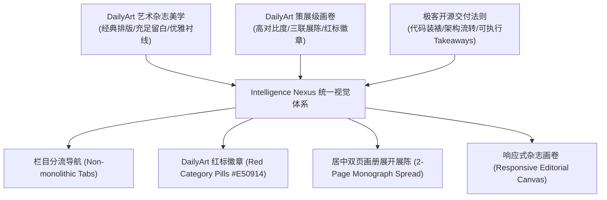

# 网站设计哲学与内容体系架构指南 (Design & Content System)

> **文档性质**：Intelligence Nexus 网站 UI/UX 美学设计原则与全维内容体系规范  
> **设计灵感源**：**100% 严格复刻 DailyArt Magazine (Refero Site ID 571, dailyartmagazine.com)**，拒绝任何混杂模板  
> **核心目标**：构建兼具顶级艺术杂志美学质感、高对比度报刊排版与极客深度的高信噪比决策门户  

---

## 一、 网站设计哲学与 UI/UX 规范 (Design Philosophy)

传统的开发看板与数据仪表盘往往陷入“全盘罗列、单页无限滚动、冷冰冰的技术指标堆砌”的误区。**Intelligence Nexus 确立了以“DailyArt 艺术杂志 (DailyArt Magazine Editorial Experience)”为唯一基准的美学体系**。



### 1. 核心设计原则 (Core Editorial Principles)

1. **拒绝“巨石单页拼凑” (Anti-Monolithic Architecture)**：
   * **严禁**把所有模块（创作者名单、每日行情、选题模型、Hook拆解、路线图）机械粗暴地堆叠在单页上；
   * 采用**模块化栏目导航（Tabs / Sub-routes）**：用户在不同栏目之间无缝平滑切换，不需要在单页上来回滚动上百行。
2. **杂志级字体与排版层级 (Typography Hierarchy)**：
   * **主标题与刊头**：采用典雅大气的 **Editorial Serif**（如 Playfair Display, Merriweather, Georgia），营造权威沉稳的报刊第一印象；
   * **正文与元数据**：采用清晰高可读性的现代无衬线字体（Inter, System Sans），代码与指标使用等宽字体（JetBrains Mono, Fira Code）；
   * **字符间距与行高**：正文行高保持在 `1.7 ~ 1.8`，标题字距紧致微调（`tracking-tight`），保证长文与深度策略复盘阅读不疲劳。
3. **留白与空间韵律 (Whitespace & Spatial Rhythm)**：
   * 遵循“充足呼吸感”准则：卡片之间、栏目段落之间保持大尺度间距（`gap-6` 至 `gap-10`，`py-12` 至 `py-16`）；
   * 卡片避免生硬厚重的深阴影，采用超细精致边框（`border-stone-200 / border-zinc-800`）配合极轻柔的微阴影（`shadow-sm`）。
4. **多级元数据标签系统 (Metadata & Badges)**：
   * 设立双层过滤系统：
     * **主赛道（Tracks）**：`AI 深度解读` vs `AI 量化交易`；
     * **权威梯队（Tiers）**：`头部权威`、`新锐先锋`、`代码基建`、`实战派黑马`；
   * 每一位博主与研报卡片均配有醒目的专属状态色块，快速建立观众视觉心智。
5. **沉浸式档案抽屉与详情视图 (Dossier Slide-over View)**：
   * 点击任意创作者卡片时，不是生硬跳转新页面，而是展开沉浸式的**全维画像抽屉（Drawer / Modal）**；
   * 完整呈现博主简介、爆款代表作、黄金 30 秒 Hook 脚本实录、实盘完播率节奏与针对创作者/量化交易者的具体行动建议（Actionable Takeaways）。

---

## 二、 核心内容体系与三大业务支柱 (Content System)

Nexus 构建了面向顶级 AI 开发者与量化从业者的三大结构化内容支柱：

### 支柱 1：AI 与量化创作者智库 (Creators Intelligence Hub)
收录全球 40 位最具代表性的 AI/量化博主（数据源存储于 [`src/data/creatorsData.ts`](file:///C:/Users/winbox-lab/gemini/src/data/creatorsData.ts)）：

#### ① 爆款选题四象限模型 (Viral Content Quadrants)
* **极限实测型 (Curiosity / Proof)**：直接展示真实盈亏曲线（PnL）或运行实况，以悬念打破观众防线（例：“我让 Claude 跑了 7 天实盘，结果居然...”）；
* **降维重塑型 (Disruption / Efficiency)**：展示生产力暴增的 AI 工作流，把 3 周手工活压缩至 10 分钟（例：“还在手动写策略？用 Cursor+RBI 框架生成并回测”）；
* **防坑打假型 (Authority / Counter-Intuition)**：用学术与统计实据戳破市场神话，建立极高专业信任（例：“揭秘 99% 回测都在造假：过度拟合的 3 个致命陷阱”）；
* **开箱开源型 (High Perceived Value)**：代码级无保留交付，通过 GitHub 沉淀铁杆技术社群（例：“全网首发！开源我自用的多智能体加密货币高频监控 Bot”）。

#### ② 黄金前 30 秒 Hook 脚本拆解 (The 30-Second Hook Formulas)
* **模式 A（冲突 + 悬念 + 成果即刻展示）**：
  * `00:00 - 00:05`：视觉冲击，展示实时 PnL 盈亏图或代码终端；
  * `00:06 - 00:15`：直击低效繁琐的人工写策略痛点；
  * `00:16 - 00:30`：无课不割，直接打开 VS Code 开源带克隆。
* **模式 B（思维颠覆 + 认知重构）**：
  * `00:00 - 00:10`：颠覆常识，直指传统 Python Pandas 回测又慢又过拟合；
  * `00:11 - 00:25`：给出纯向量化 VectorBT 8 秒提速与蒙特卡洛防坑实操。

#### ③ 完播率留存五步节奏 (Retention Framework)
`问题暴露 (Problem)` ➔ `AI 协作实录 (AI in Action)` ➔ `回测与压力测试 (Stress Test)` ➔ `硬性风控熔断器 (Kill-Switch)` ➔ `开源号召与交付 (Call to Action)`。

#### ④ 顶级量化实战四阶段路线图 (Quant Roadmap)
* **阶段一：基础设施构建 (Infra)**：Python 3.11+, VS Code/Cursor, CCXT, Alpaca API；
* **阶段二：回测与数学归因 (Backtesting)**：VectorBT, Backtrader, Freqtrade, Sharpe > 1.5, Max Drawdown < 15%；
* **阶段三：AI / LLM 智能体赋能 (Agentic)**：Claude, Cursor, LangGraph, 多智能体分工审查闭环；
* **阶段四：模拟盘与实盘防御 (Live Defense)**：Paper Trading 4-8周, Hard Kill-Switch 物理熔断, 微小资金实盘。

---

### 支柱 2：每日多维情报专报 (Daily Dispatch & Market Sentiment)
* **多市场行情速览**：加密货币、美股科技龙头、宏观流动性指标；
* **学术前沿追踪**：每日自动化爬取 arXiv AI/量化高分新论文并提炼核心贡献；
* **双维度情绪指数**：传统金融情绪（CNN Fear & Greed）+ 加密流动性情绪（Crypto Fear & Greed Index）。

---

### 支柱 3：YouTube 自动化深度调研流水线 (YouTube Research Pipeline)
* 融合 **API 趋势发现**、**RSS XML 零配额最新 15 视频订阅**、**API 批量元数据增强** 与 **公开 TimedText 字幕 (SRT) 提取**；
* 形成“自动发现新趋势 ➔ 自动拉取博主动态 ➔ 自动提炼核心量化策略”的闭环。

---

## 三、 7 大独立展厅专属视觉系统与调色板 (Seven Department Themes)

为彻底破除“巨石单页拼凑”与“不同栏目风格雷同”的痛点，Nexus 严格依据 **DailyArt Magazine** 在首页特辑、流派展陈、产品目录与特刊专栏等不同页面的经典布局与调色，为 7 大核心专栏定制了独立的气质与设计系统：

| 专栏编号 | 栏目名称 | 核心主题与 DailyArt 页面美学映射 | 日间模式底色 (Light) | 夜间模式底色 (Dark) | 标志性点缀色 (Accent) |
| :--- | :--- | :--- | :--- | :--- | :--- |
| **DEPT 01** | **封面导读 (`cover`)** | **DailyArt 杂志刊头与主特辑** (Screen `11989a2e`) · 经典 3-Story Hero 布局 | `#FFFFFF` / `#FAF9F5` (画廊白) | `#0C0E14` (曜石冷黑) | `#E50914` DailyArt 经典绯红 / 细线黑金 |
| **DEPT 02** | **前沿范式 (`ai`)** | **DailyArt 艺术流派深度学术专报** (Screen `b91050ab`) · 长文机制深度拆解 | `#F4F7FB` (档案冷青白) | `#090D18` (深空海军蓝) | `#E50914` 绯红标签 / `#1E3A8A` 研报蓝 |
| **DEPT 03** | **量化展厅 (`quant`)** | **DailyArt 装裱级画作展陈** · 博物馆展签 (Museum Placard) 代码画卷 | `#F5F2EB` (美术馆画纸) | `#08090C` (特展暗室黑) | `#B88E39` 烫金 / `#E5C378` 浅金 |
| **DEPT 04** | **创作者智库 (`creators`)** | **DailyArt 艺术家全维画册** · 居中 1580px 宽幅双页展陈 (2-Page Monograph) | `#FFFFFF` / `#FAF6F0` (洞石白) | `#0D0F16` (档案室深黑) | `#E50914` DailyArt 经典绯红 / `#111111` |
| **DEPT 05** | **爆款与路线 (`playbook`)** | **DailyArt 创作者思维蓝图** · 四象限选题与留存节拍条 | `#EEF4F8` (晒图纸青灰) | `#080F1E` (深邃工程蓝) | `#E50914` 经典绯红 / `#4338CA` 靛青 |
| **DEPT 06** | **股期全景 (`markets`)** | **DailyArt 艺术资产与行情策展账本** (Screen `6feb2a6b`) · 跨资产目录画卷 | `#FFFFFF` (纯白展厅) | `#0E1017` (曜石深黑展厅) | `#E50914` DailyArt 经典绯红 / `#111111` 浓墨 |
| **DEPT 07** | **晨报速递 (`gazette`)** | **DailyArt 订阅与读者通讯专报** (Screen `96a4f452`) · 双联卡片读者邀约 | `#FAF9F5` (晨报特刊纸) | `#0E1017` (暗室冷墨) | `#E50914` 经典绯红按钮 / 极细双线 |

---

## 四、 页面版式与配图审美规范 (Visual & Editorial Invariants)

1. **画布规格 (Canvas Scale)**：
   * 采用超宽幅杂志画卷：`max-w-[1720px] mx-auto px-4 sm:px-8 lg:px-12 xl:px-16`；
   * 彻底摒弃窄小的 1280px 居中局促框，保证多列排版与宽幅图表有充足呼吸空间。
2. **文字排版品味 (Typographic Taste)**：
   * **巨幅报刊主标题**：`text-5xl sm:text-7xl lg:text-8xl font-serif font-black tracking-tight leading-[1.06]`；
   * **首字下沉 (Authentic Drop-Cap)**：主故事首段必须使用 3.8rem 大号古典衬线体首字下沉；
   * **大幅引语 (Monumental Pull-Quote)**：采用 `text-2xl sm:text-4xl font-serif italic` 配合装饰性引语记号；
   * **正文舒适行高**：保持在 `leading-relaxed`（约 1.75 - 1.8），每行 65-75 字符最佳阅读宽度。
3. **配图与图表设计感 (Graphic Aesthetics - 拒绝 AI 塑料感)**：
   * **严禁**使用无意义、充满廉价光效的通用 AI 概念插画；
   * **采用古典铜版雕刻 (Copperplate Engravings) 与精细线框拓扑图**：
     * `PLATE I // SYSTEM TRANSMISSION MATRIX`：细线条框线、高对比度参数卡片、优雅箭头指引；
     * `装裱级代码画作 (Framed Code Canvas)`：暗色磨砂玻璃代码窗口、带红黄绿控制点、等宽高亮代码、一键复制；
     * `展签式数据徽章 (Museum Placards)`：双线古典边框、罗马数字标号（FIG I.0 / PLATE IV）。
4. **创作者画册跨页展陈 (Grand Editorial Monograph Spread - 告别右侧狭窄抽屉，拥抱居中宽幅 2-Page 展开展陈)**：
   * 点击创作者卡片后，在屏幕中央弹出 `max-w-[1580px]` 宽幅两页合刊展陈（Double-Page Broadsheet Spread），彻底杜绝“只有右半边显示、左边大面积空置”的狭窄感；
   * **左页 (Page I · 5 列 / ~42%)**：学者肖像徽章、学术定位、首字下沉传记、量化实盘启示、前 30 秒黄金抓手公式（0-6s/6-16s/16-30s 节拍条）与学术标签；
   * **右页 (Page II · 7 列 / ~58%)**：三大代表作深度拆解、文案剧本架构分析、官方 RSS 零配额最新视频流（含真实标题与链接）；
   * **顶/底双轨控制器**：支持 `[←] [→]` 键盘快捷键无缝翻阅 40 位博主、`[ESC]` 退出画册，以及上一位/下一位无级翻页与官方 YouTube 直达。

---

## 五、 内容“做厚、做实”的标准 (Content Density Standards)

- **严禁薄弱的泛泛空谈**：每项研报必须具备微观机制假设、数学推导公式与具体代码复现。
- **量化策略交付标准**：包含夏普比率（Sharpe Ratio > 2.5）、最大回撤（Max Drawdown < 10%）、交易频率与完整的 Python 3.11+ VectorBT 向量化回测脚本。
- **创作者拆解标准**：每位博主必须给出真实可读的 30 秒剧本文案，标注核心痛点与转化技巧。

---

## 四、 设计师 Skills 赋能矩阵与工具流 (Designer Skills Ecosystem)

为了解决“参考设计稿却无法精准还原神韵”、“产出千篇一律 AI 工业模板”的痛点，环境已全面装配全球主流顶尖设计师 Skill 矩阵：

| Skill 标识 | 研发源 | 核心设计职能 | 触发与调用方式 |
| :--- | :--- | :--- | :--- |
| **`frontend-design`** | Anthropic 官方 | **破除 AI 模板套路**。强制意图优先、个性化衬线/无衬线搭配、克制留白与排版反套路设计。 | 编写/重构前端页面时自动遵循或显式调用 |
| **`ui-ux-pro-max`** | NextLevelBuilder | **全能设计系统与智能决策库**。本地内置 79 款主流设计风格（含 Editorial Grid / Magazine）、192 组色盘与 74 对字体层级。 | 终端随时检索：`python .agents/skills/ui-ux-pro-max/scripts/search.py "<query>" --domain <domain>` |
| **`web-design-guidelines`** | Vercel Labs | **工程级 Web 交互与可访问性审查**。100+ 条 UX、聚焦态、触摸热区与视差指标校验。 | UI 构建后审查审计 |
| **`design-system`** | Agent Skills | **Design Tokens 与原子组件规范**。Tailwind 语义化主题配置与跨端组件变体封装。 | 基础设计系统搭建 |

### 实操范例：复刻杂志风 (Editorial Grid Magazine)
智能体可直接利用 `ui-ux-pro-max` 内置的 `editorial-grid-magazine` 规则库指导 CSS 与排版：
```bash
python .agents/skills/ui-ux-pro-max/scripts/search.py "editorial magazine" --domain style
```
* **核心排版变量**：
  * 大标题字体：`Georgia / Merriweather / Playfair`
  * 首字下沉（Drop Caps）：`::first-letter { font-size: 4em; }`
  * 呼吸感留白：`column-gap: 2rem`，多栏杂志报刊网格
  * 对比度标准：严守 WCAG AA 4.5:1 基线，彻底杜绝“灰底浅灰字”的不可读问题。
