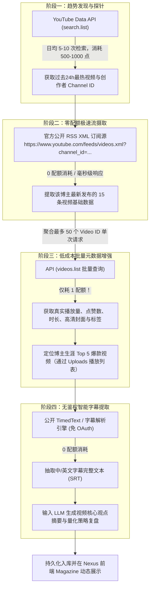

# YouTube AI & 量化交易调研自动化流水线架构指南

> **文档状态**：已外部化持久存储  
> **核心机制**：API 趋势探测 + RSS 零配额订阅 + API 批量增强 + 公开 TimedText 字幕提取  
> **关联智库**：包含 40 位 AI/量化顶级博主全维画像 (`src/data/creatorsData.ts`)  

---

## 1. 架构总览与核心设计思想

传统的 YouTube 数据抓取通常面临两大痛点：
1. **纯前台爬虫**：极易被 Google BotGuard 风控识别，导致 IP 被拉黑（429 Too Many Requests）甚至引发账户关联受阻。
2. **纯官方 API**：`search.list` 每次查询消耗 100 配额单位，直接调用官方下载字幕接口对非自有视频还会返回 403 权限拒绝，导致每日 10,000 配额瞬间见底。

针对以上瓶颈，本项目确立了**四阶混合流（Hybrid Pipeline）**：



---

## 2. 每日配额经济学分析 (10,000 Quota Units Budget)

| 操作项目 | 调用的端点 / 协议 | 单次配额消耗 | 建议执行频次 | 每日总配额消耗 | 配额占比 |
| :--- | :--- | :--- | :--- | :--- | :--- |
| **趋势热点探测** | `youtube.search.list` | **100 units** | 每天 5 ~ 8 个热点关键词 | 500 ~ 800 units | 5% ~ 8% |
| **最新 15 视频更新**| **公共 RSS XML** | **0 units** | 轮询 40 ~ 100 位博主 | **0 units** | 0% |
| **批量视频统计增强**| `youtube.videos.list` | **1 unit / 50条** | 每天 4 次批处理（200 条视频） | **4 units** | < 0.1% |
| **博主爆款 Top 5** | `youtube.playlistItems.list`| **1 unit / 频道** | 针对重点关注的 20 位博主 | **20 units** | 0.2% |
| **视频字幕与文本** | **公共 TimedText 协议** | **0 units** | 按需提取高热度视频字幕 | **0 units** | 0% |
| **每日合计** | — | — | — | **~524 - 824 units** | **安全冗余 > 90%** |

---

## 3. 40 位 AI 与量化博主智库资产结构

项目内置了详尽的 40 位行业权威创作者数据，存储于：
- 生产环境数据源：[`src/data/creatorsData.ts`](file:///C:/Users/winbox-lab/gemini/src/data/creatorsData.ts)
- 原始全量档案：`C:\Users\winbox-lab\antigravity\web_portal\creators_data.js`
- 聚合构建脚本：[`scripts/mergeCreators.js`](file:///C:/Users/winbox-lab/gemini/scripts/mergeCreators.js)

### 分类矩阵 (Creator Categorization)
1. **AI 头部权威 (`ai-top`)**：Andrej Karpathy, Yannic Kilcher, Two Minute Papers, 3Blue1Brown 等。
2. **AI 新锐实战派 (`ai-rising` / `ai-trend`)**：Matt Wolfe, Matthew Berman, AI Explained, David Ondrej 等。
3. **量化代码基建派 (`quant-classic`)**：Part Time Larry, Sentdex, Trade Like a Quant, Algotrading with Python 等。
4. **AI 量化实战黑马 (`quant-rising`)**：Moon Dev, DaviddTech, Quant Science, Critical Trading 等。

---

## 4. 关键代码模块实现说明

### 4.1 官方 RSS 零配额拉取最新 15 条
```javascript
// URL 格式规范
const rssUrl = `https://www.youtube.com/feeds/videos.xml?channel_id=${channelId}`;
// 返回 XML 包含:
// - yt:videoId: 视频唯一 ID
// - title: 视频标题
// - published: ISO 8601 发布时间戳
// - media:description: 视频基础简介
```

### 4.2 批处理详情丰富 (Batch Enrichment)
```javascript
// 核心优化：逗号拼接 videoId，每 50 个视频合并为 1 次请求，只扣 1 点配额
const ids = videoIdList.slice(0, 50).join(',');
const url = `https://www.googleapis.com/youtube/v3/videos?part=snippet,contentDetails,statistics&id=${ids}&key=${apiKey}`;
```

### 4.3 免 OAuth 获取视频公开字幕 (TimedText)
> **技术避坑点**：Google 官方 `captions.download` 仅限频道所有者本人使用（API Key 访问第三方视频会报 403）。获取公开第三方视频字幕应使用公共 TimedText 协议解析器（如 Node.js 库 `youtube-transcript` 或 Python `youtube-transcript-api`）。

---

## 5. 安全运行与防风控原则
1. **彻底解耦个人账户**：所有采集脚本在独立的 Node.js/Python 进程或无痕沙箱下运行，**严禁携带个人 Google 账号的 Cookie/Session**。
2. **请求抖动（Jitter）**：RSS 轮询不同博主时，设置 `2000ms ~ 5000ms` 的随机休眠，杜绝高并发瞬时打垮网络。
3. **429 自动熔断**：一旦收到限流提示，立即挂起当前爬虫并转入休眠，避免持续重试引发长效 IP 标记。
